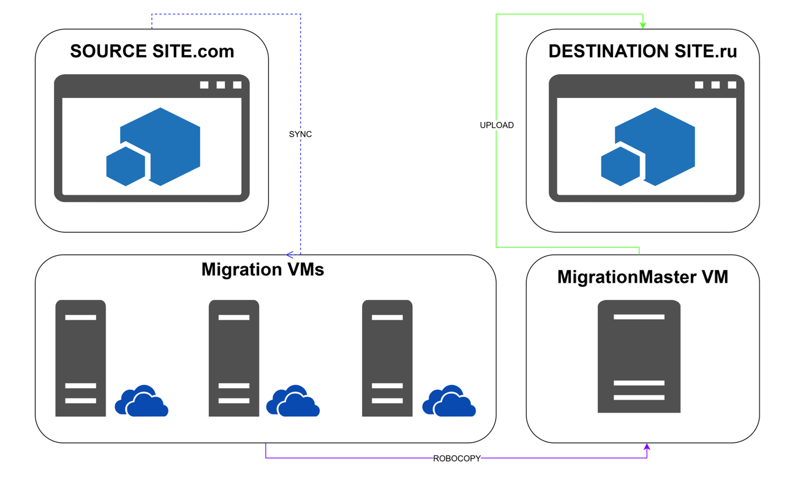

# Sharepoint SiteUploader

[](https://docs.microsoft.com/powershell/) [](https://products.office.com/sharepoint) [](https://onedrive.live.com/) [](https://www.office.com/)

Automated PowerShell tool for bulk uploading files to SharePoint.

<!-- TOC tocDepth:2..3 chapterDepth:2..6 -->
- [Sharepoint SiteUploader](#sharepoint-siteuploader)
  - [Introduction](#introduction)
  - [Project Structure](#project-structure)
  - [Dependencies and Prerequisites](#dependencies-and-prerequisites)
  - [Diagram](#diagram)
  - [Getting Started](#getting-started)
    - [Step 1: Transfer the script to the machine from which you'll upload sites](#step-1-transfer-the-script-to-the-machine-from-which-youll-upload-sites)
    - [Step 2: Configure the settings](#step-2-configure-the-settings)
    - [Step 3: Run the script](#step-3-run-the-script)
  - [Parallel Processing Plan with RunMigrations.ps1](#parallel-processing-plan-with-runmigrationsps1)
    - [Recommendations for Parallel Execution](#recommendations-for-parallel-execution)
  - [Launch Parameters](#launch-parameters)
    - [-ConfigPath](#-configpath)
    - [-ExistingCsvPath](#-existingcsvpath)
    - [-SplitCsvFolderPath](#-splitcsvfolderpath)
  - [How It Works](#how-it-works)
    - [Loading Configuration](#loading-configuration)
    - [Renaming Files and Folders](#renaming-files-and-folders)
    - [Generating CSV Files](#generating-csv-files)
    - [Uploading Files to SharePoint](#uploading-files-to-sharepoint)
    - [Logging and Statistics](#logging-and-statistics)
  - [Potential Issues and Solutions](#potential-issues-and-solutions)
    - [Environment Check Example](#environment-check-example)
    - [PowerShell Execution Policy](#powershell-execution-policy)
    - ["Long Paths Not Supported" Error](#long-paths-not-supported-error)
    - ["CSV File Not Found" Error](#csv-file-not-found-error)
    - ["Failed to Connect to SharePoint" Error](#failed-to-connect-to-sharepoint-error)
<!-- /TOC -->


## Introduction
Instead of manually drag-and-dropping folders to a site or using separate scripts and manually renaming files, generating CSVs, and uploading them separately, you can simply run this script and go ~~drink coffee~~ work on other tasks.

It’s designed to simplify data migration to SharePoint. It can:
- Rename files and folders to ensure they upload correctly to SharePoint.
- Generate CSV files with file information for sites.
- Split large CSVs into smaller chunks (if there are many files).
- Upload files to SharePoint sites, skipping those that already exist.

All of this can be done for a single site or multiple sites simultaneously.

## Project Structure
```powershell
SP_SiteUploader/
├── Main.ps1                                    # Main script for migration
├── README.md                                   # Documentation
├── config.ps1                                  # Main configuration file
├── RunMigrations.ps1                           # Script for parallel migration execution
├── LegacyScripts/                              # Legacy scripts
│   ├── create_csv.ps1                          # CSV generation
│   ├── split_csv_to_folders.ps1                # CSV splitting
│   ├── files_rename_for_sp_site.ps1            # File renaming
│   └── upload_data_with_skip_exists_v5.ps1     # File upload
├── Modules/                                    # Core modules
│   ├── Renamer.ps1                             # CSV generation
│   ├── Uploader.ps1                            # CSV splitting
│   ├── CsvSplitter.ps1                         # File renaming
│   └── CsvGenerator.ps1                        # File upload
├── OriginalScripts/                            # Early script versions
│   ├── create_csv_v4.ps1                       
│   ├── split_csv_to_folders.ps1                
│   ├── files_rename_for_sp_site_v2.ps1         
│   └── upload_data_with_skip_exists_v5.ps1     
└── Sites/                                      # Site configuration files
    ├── Site1.ps1                               # Example site configuration
    └── ...                                     # Other configuration files
```

## Dependencies and Prerequisites

**PowerShell 5.1* or higher** — The script only works on Windows.
**Must be logged into SharePoint with an admin account**.
Folder structure for site data on disk should be: `M:\MigrationMaster\Russia - Site Assets` where:
* `Russia` — Site name
* `Site Assets` — Library name

This structure is obtained when syncing sites via OneDrive.
You can adjust it in the configuration if needed.

**Before uploading files to a site, ensure**:
* The site (subsite) is created.
* All required libraries exist.

## Diagram



## Getting Started
The script runs on Windows machines in PowerShell or SharePoint 2019 Management Shell.

### Step 1: Transfer the script to the machine from which you'll upload sites   
- Copy the SP_SiteUploader folder to your desktop, open a console, and navigate to it, e.g.:
cd `C:\Users\your-user-account\Desktop\SP_SiteUploader`     

### Step 2: Configure the settings
The main configuration file is **config.ps1**.
- Open it in a code/text editor and customize:
  - `site.name` — Site name
  - `site.target_url` — Target SharePoint site URL
  - `mappings` —  Local folder to SharePoint library mappings
  - `processing` — Processing steps (renaming, CSV generation, upload)
  - `paths` — Paths for logs, CSVs, and temp files

Example configuration:
```powershell
@{
    site = @{
        name = "Russia"
        target_url = "https://sharepoint.domain.ru/sites/Russia"
    }
    mappings = @{
        "M:\MigrationMaster\Russia - Site Assets" = "Site Assets"
        "M:\MigrationMaster\Russia - Documents" = "Shared Documents"
    }
    processing = @{
        enable_renaming = $true
        enable_csv_generation = $true
        enable_csv_splitting = $false
        enable_upload = $true
    }
    paths = @{
        logs_root = "M:\MIGRATION_LOGS\"
        csv_root = "M:\CSV_FOR_SCRIPT\"
        split_files = "M:\CSV_FOR_SCRIPT\SplitCSV"
        rename_logs = "M:\RENAME_LOGS\"
        csv_logs = "M:\CSV_LOGS\"
        upload_logs = "M:\UPLOAD_LOGS\"
        split_logs = "M:\SPLIT_LOGS\"
    }
}
```

- Create the log folders specified in `paths` on the machine 
- Copy `config.ps1` to the `Sites` folder and rename it according to the site name (e.g., Site1.ps1). This lets you save configurations per site 

### Step 3: Run the script
Use `Main.ps1` and specify the configuration file path:
```powershell
.\Main.ps1 -ConfigPath ".\Sites\Site1.ps1"
```

## Parallel Processing Plan with RunMigrations.ps1
To process multiple sites simultaneously, use `RunMigrations.ps1`. It handles configs from `\Sites\` and runs them in parallel.

- In `RunMigrations.ps1`, list the configs:
In the `$configFiles` array, specify paths to all config files you want to run
```ps1
$configFiles = @(
    ".\Sites\Site1.ps1",
    ".\Sites\Site2.ps1",
    ".\Sites\Site3.ps1",
    ".\Sites\Site4.ps1",
    ".\Sites\Site5.ps1"
) | ForEach-Object { Resolve-Path $_ }
```
In `$maxParallelTasks`, set the maximum number of concurrent migrations (e.g., 3 means only 3 background jobs run at once).  
```ps1
$maxParallelTasks = 3
```
- Open PowerShell and run: `.\RunMigrations.ps1`  

After launch, you’ll see a status screen updated every 60 seconds:
```
[2025-03-19 16:04:38] Completed job for: SharepointSite1
[2025-03-19 16:05:38] Completed job for: SharepointSite2
[2025-03-19 16:06:38] Completed job for: SharepointSite3
[2025-03-19 16:09:39] Completed job for: SharepointSite4

Timestamp           Id Name                     State
---------           -- ----                     -----
2025-03-19 16:09:39 1  SharepointSite1          Completed
2025-03-19 16:09:39 3  SharepointSite2          Completed
2025-03-19 16:09:39 5  SharepointSite3          Completed
2025-03-19 16:09:39 7  SharepointSite4          Completed

JOBS COMPLETED: 4/4
[2025-03-19 16:09:39] All jobs completed.
```

### Recommendations for Parallel Execution
**Ensure paths don’t conflict**  
Make sure log, CSV, and temp file paths in different configs don’t overlap. For example:
- For `Site1` use `M:\MIGRATION_LOGS\Site1`  
- For `Site2` use `M:\MIGRATION_LOGS\Site2`  

**Use SSD**  
If possible, use SSDs for temp files and logs to speed up read/write operations.

## Launch Parameters
```ps1
param(
    [string]$ConfigPath = ".\config.ps1",  # Path to config file
    [string]$SiteName,                     # Site name
    [bool]$EnableRenaming,                 # Enable/disable renaming
    [bool]$EnableCsvGeneration,            # Enable/disable CSV generation
    [bool]$EnableCsvSplitting,             # Enable/disable CSV splitting
    [bool]$EnableUpload,                   # Enable/disable upload
    [string]$LogFolderPath,                # Log folder path
    [string]$CsvFolderPath,                # CSV folder path
    [string]$SplitFolderPath,              # Split CSV folder path
    [string]$ExistingCsvPath,              # Path to existing CSV
    [string]$SplitCsvFolderPath            # Path to split CSV files
)
```

### -ConfigPath
The `-ConfigPath` key specifies the path to the config file containing migration settings. Useful for multiple site configs or custom configs:
```powershell
.\Main.ps1 -ConfigPath ".\Sites\SiteName.ps1"
```

### -ExistingCsvPath
Use `-ExistingCsvPath` to upload from an existing CSV:
```powershell
.\Main.ps1 -ConfigPath ".\Sites\SiteName.ps1" `
           -ExistingCsvPath "M:\CSV_FOR_SCRIPT\SiteName_2023-10-15_12-30-45.csv" `
```

### -SplitCsvFolderPath
Use `-SplitCsvFolderPath` to upload from split CSV files:
```powershell
.\Main.ps1 -ConfigPath ".\Sites\SiteName.ps1" `
           -SplitCsvFolderPath "M:\CSV_FOR_SCRIPT\SplitCSV\SplitCSV_SiteName" `
```

When using `-SplitCsvFolderPath` or `-ExistingCsvPath`:
- Renaming, CSV generation, and splitting are skipped.
- The script proceeds directly to uploading from the specified CSV source.


## How It Works  
### Loading Configuration
The script loads settings from `config.ps1`, including::
* Folder paths (logs, CSVs, temp files)
* Site settings (URL, name)
* Processing parameters (enable/disable steps)

### Renaming Files and Folders
The script removes `;` from file and folder names.
Logs are saved in `paths.rename_logs`.

### Generating CSV Files
The script creates a CSV with file/folder info for SharePoint uploads.
Example CSV row:
```csv
SiteURL;LibraryName;SPFolder;FilePath;FileName
https://sharepoint.domain.ru/sites/Russia;Site Assets;Documents;M:\MigrationMaster\Russia - Site Assets\doc1.docx;doc1.docx
```

### Uploading Files to SharePoint
* Connects to the target SharePoint site using the URL from the config
* Uses `Microsoft.SharePoint.PowerShell` for connectivity
* Checks if each file already exists on SharePoint
* Uploads new files; skips existing ones (logged)

### Logging and Statistics
All actions are logged, including successes, skips, and errors.
Example:
```plaintext
[2025-03-15 10:00:00] [INFO] Starting file renaming process for Russia
[2025-03-15 10:00:01] [INFO] Renamed: M:\MigrationMaster\Russia - Site Assets\doc1.docx
[2025-03-15 10:00:02] [INFO] CSV file created: M:\CSV_FOR_SCRIPT\Russia_2025-03-15_10-00-01.csv
[2025-03-15 10:00:03] [INFO] Uploaded: doc1.docx (2.5 MB) in 1.2 sec
[2025-03-15 10:00:04] [WARNING] Skipped (exists): doc2.docx
[2025-03-15 10:00:05] [ERROR] Error uploading doc3.docx: Access denied
```

After each step, statistics are displayed.

**For file/folder renaming**
```plaintext
=== Renaming Statistics ===
Total files: 10 | Renamed files: 8
Total folders: 2 | Renamed folders: 1
Errors: 0
Log: M:\RENAME_LOGS\Renaming_Russia_2025-03-15_10-00-00.txt
```

**For CSV generation**
```plaintext
=== CSV Generation Statistics ===
Total files processed: 10
CSV file created: M:\CSV_FOR_SCRIPT\Russia_2025-03-15_10-00-01.csv
Log: M:\CSV_LOGS\CsvGeneration_Russia_2025-03-15_10-00-01.txt
```

**For uploads**
```plaintext
=== Upload Statistics ===
Total files processed: 10
Successfully uploaded: 7
Skipped (already exists): 2
Failed uploads: 1
Total uploaded size: 15.3 MB
Log: M:\UPLOAD_LOGS\Upload_Russia_2025-03-15_10-00-03.txt
```

## Potential Issues and Solutions
If something goes wrong, check the logs in the folders specified in `config.ps1`.  

### Environment Check Example
```ps1
# Check PowerShell version
$PSVersionTable.PSVersion

# Check execution policy
Get-ExecutionPolicy -List

# Check SharePoint availability
$siteURL = "https://sharepoint.internal.ru/sites/Russia"
Test-NetConnection -ComputerName (([System.Uri]$siteURL).Host) -Port 443
```

### PowerShell Execution Policy
Ensure execution policy allows script runs: `Set-ExecutionPolicy -ExecutionPolicy RemoteSigned -Scope CurrentUser`  

### "Long Paths Not Supported" Error
Enable long path support:
- Open Registry Editor (regedit)
- Navigate to: `HKEY_LOCAL_MACHINE\SYSTEM\CurrentControlSet\Control\FileSystem`
- Set `LongPathsEnabled` to `1`.

### "CSV File Not Found" Error
Verify:
* Paths in `config.ps1` are correct
* Folders/files exist

### "Failed to Connect to SharePoint" Error
Ensure:
* You have SharePoint access
* The site URL is correct (no /Pages/Home.aspx)