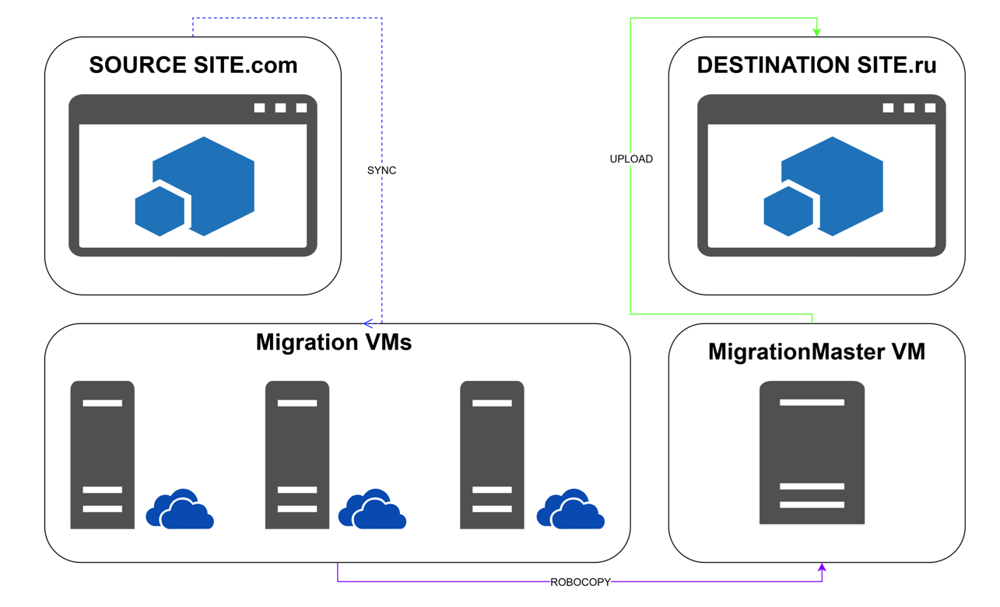

# Sharepoint SiteUploader

[](https://docs.microsoft.com/powershell/) [](https://products.office.com/sharepoint) [](https://onedrive.live.com/) [](https://www.office.com/)

Автоматизированный инструмент PowerShell для массовой загрузки файлов в SharePoint.

<!-- TOC tocDepth:2..3 chapterDepth:2..6 -->
- [Sharepoint SiteUploader](#sharepoint-siteuploader)
  - [Введение](#введение)
  - [Структура проекта](#структура-проекта)
  - [Зависимости и предпосылки](#зависимости-и-предпосылки)
  - [Схема](#схема)
  - [Начало работы](#начало-работы)
    - [Шаг 1: Перенести скрипт на машину с которой будешь загружать сайты](#шаг-1-перенести-скрипт-на-машину-с-которой-будешь-загружать-сайты)
    - [Шаг 2: Настроить конфигурацию](#шаг-2-настроить-конфигурацию)
    - [Шаг 3: Запустить скрипт](#шаг-3-запустить-скрипт)
  - [План параллельной обработки с RunMigrations.ps1](#план-параллельной-обработки-с-runmigrationsps1)
    - [Рекомендации для параллельного запуска](#рекомендации-для-параллельного-запуска)
  - [Параметры запуска](#параметры-запуска)
    - [-ConfigPath](#-configpath)
    - [-ExistingCsvPath](#-existingcsvpath)
    - [-SplitCsvFolderPath](#-splitcsvfolderpath)
  - [Как это работает](#как-это-работает)
    - [Загрузка конфигурации](#загрузка-конфигурации)
    - [Переименование файлов и папок](#переименование-файлов-и-папок)
    - [Генерация CSV-файла](#генерация-csv-файла)
    - [Загрузка файлов на SharePoint](#загрузка-файлов-на-sharepoint)
    - [Логирование и статистика](#логирование-и-статистика)
  - [Возможные проблемы и решения](#возможные-проблемы-и-решения)
    - [Пример проверки окружения](#пример-проверки-окружения)
    - [Политика выполнения PowerShell](#политика-выполнения-powershell)
    - [Ошибка "Длинные пути не поддерживаются"](#ошибка-длинные-пути-не-поддерживаются)
    - [Ошибка "CSV файл не найден"](#ошибка-csv-файл-не-найден)
    - [Ошибка "Не удалось подключиться к SharePoint"](#ошибка-не-удалось-подключиться-к-sharepoint)
<!-- /TOC -->


## Введение
Вместо того чтобы вручную  закидывать драг-н-дропом папки на сайт, или юзать отдельные скрипты и опять же руками переименовывать файлы, генерировать CSV и отдельно загружать с них, ты можешь просто запустить этот скрипт и пойти ~~пить кофе~~ работать над другими задачами.

Он создан для того, чтобы упростить жизнь тем, кто занимается миграцией данных на SharePoint. Он умеет:
- Переименовывать файлы и папки, чтобы они корректно заехали на сайт SharePoint.
- Генерировать CSV-файлы с информацией о файлах для сайтов.
- Дробить большие CSV на части (если файлов много).
- Загружать файлы на сайты SharePoint, пропуская те, что уже есть.

И всё это можно делать как для одного сайта, так и для нескольких сразу.

## Структура проекта
```powershell
SP_SiteUploader/
├── Main.ps1                                    # Главный скрипт для запуска миграции
├── README.md                                   # Документация
├── config.ps1                                  # Основной конфигурационный файл
├── RunMigrations.ps1                           # Скрипт для параллельного запуска миграций
├── LegacyScripts/                              # Cкрипты
│   ├── create_csv.ps1                          # Генерация CSV
│   ├── split_csv_to_folders.ps1                # Разделение CSV
│   ├── files_rename_for_sp_site.ps1            # Переименование файлов
│   └── upload_data_with_skip_exists_v5.ps1     # Загрузка файлов
├── Modules/                                    # Основные модули
│   ├── Renamer.ps1                             # Генерация CSV
│   ├── Uploader.ps1                            # Разделение CSV
│   ├── CsvSplitter.ps1                         # Переименование файлов
│   └── CsvGenerator.ps1                        # Загрузка файлов
├── OriginalScripts/                            # Ранние версии скриптов
│   ├── create_csv_v4.ps1                       
│   ├── split_csv_to_folders.ps1                
│   ├── files_rename_for_sp_site_v2.ps1         
│   └── upload_data_with_skip_exists_v5.ps1     
└── Sites/                                      # Конфигурационные файлы для сайтов
    ├── Site1.ps1                               # Пример конфигурации для сайта
    └── ...                                     # Другие конфигурационные файлы
```

## Зависимости и предпосылки

- **PowerShell 5.1** или выше — скрипт работает только на Windows.
- **Нужно быть залогиненным в Sharepoint** под УЗ с правами администрирования сайтов

- **Структура папок с данными сайтов на диске должна быть вида**: `M:\MigrationMaster\Russia - Site Assets` где:
  - *`Russia`* - название сайта  
  - *`Site Assets`* - название библиотеки  
  - 
Такая структура получается если синхронизировать сайты через OneDrive.   
Можно поменять в конфигурации при необходимости.

- **Перед тем, как загружать файлы на сайт, необходимо создать**:
  - *сам сайт (подсайт)*
  - *все нужные библиотеки*

## Схема



## Начало работы
Скрипт запускается на машинах с Windows в консоли PowerShell или SharePoint 2019 Management Shell.

### Шаг 1: Перенести скрипт на машину с которой будешь загружать сайты   
- Скопируй папку SP_SiteUploader на рабочий стол, открой консоль и перейди в эту папку, например:
 `cd C:\Users\your-user-account\Desktop\SP_SiteUploader`   

### Шаг 2: Настроить конфигурацию
Основной конфигурационный файл - **config.ps1**.
- Открой его в редакторе кода / текста и настрой под свои нужды:
  - `site.name` — имя сайта.
  - `site.target_url` — URL целевого сайта SharePoint.
  - `mappings` — связка локальных папок и библиотек SharePoint.
  - `processing` — настройки этапов обработки (переименование, генерация CSV, загрузка).
  - `paths` — пути для логов, CSV и временных файлов.

Пример конфигурации:
```powershell
@{
    site = @{
        name = "Russia"
        target_url = "https://sharepoint.domain.ru/sites/Russia"
    }
    mappings = @{
        "M:\MigrationMaster\Russia - Site Assets" = "Site Assets"
        "M:\MigrationMaster\Russia - Documents" = "Shared Documents"
    }
    processing = @{
        enable_renaming = $true
        enable_csv_generation = $true
        enable_csv_splitting = $false
        enable_upload = $true
    }
    paths = @{
        logs_root = "M:\MIGRATION_LOGS\"
        csv_root = "M:\CSV_FOR_SCRIPT\"
        split_files = "M:\CSV_FOR_SCRIPT\SplitCSV"
        rename_logs = "M:\RENAME_LOGS\"
        csv_logs = "M:\CSV_LOGS\"
        upload_logs = "M:\UPLOAD_LOGS\"
        split_logs = "M:\SPLIT_LOGS\"
    }
}
```

- Создай на машине папки для логов, которые указал в переменной `paths` 
- Скопируй `config.ps1` в папку `Sites` и переименуй его в соответствии с именем сайта (например, Site1.ps1). Так ты сможешь сохранять настройки для каждого сайта отдельно. 

### Шаг 3: Запустить скрипт
Используй скрипт `Main.ps1`, указав путь к конфигурационному файлу:
```powershell
.\Main.ps1 -ConfigPath ".\Sites\Site1.ps1"
```

## План параллельной обработки с RunMigrations.ps1
Если нужно прогрузить несколько сайтов сразу, используй `RunMigrations.ps1`. Он сам разберётся с конфигами из папки `\Sites\` и запустит всё параллельно. 

- Внеси в файл `RunMigrations.ps1` список конфигов:
В массиве `$configFiles` укажи пути ко всем конфигурационным файлам, которые хочешь запустить.
```ps1
$configFiles = @(
    ".\Sites\Site1.ps1",
    ".\Sites\Site2.ps1",
    ".\Sites\Site3.ps1",
    ".\Sites\Site4.ps1",
    ".\Sites\Site5.ps1"
) | ForEach-Object { Resolve-Path $_ }
```
В переменной `$maxParallelTasks` укажи максимальное количество одновременно выполняемых миграций. Например, значение 3 означает, что одновременно будут выполняться только 3 потока фоновых задач.
```ps1
$maxParallelTasks = 3
```
- Открой PowerShell и выполни команду: `.\RunMigrations.ps1`  

После запуска ты увидишь экран статуса: статистика обновляется раз в 60 секунд.
```
[2025-03-19 16:04:38] Completed job for: SharepointSite1
[2025-03-19 16:05:38] Completed job for: SharepointSite2
[2025-03-19 16:06:38] Completed job for: SharepointSite3
[2025-03-19 16:09:39] Completed job for: SharepointSite4

Timestamp           Id Name                     State
---------           -- ----                     -----
2025-03-19 16:09:39 1  SharepointSite1          Completed
2025-03-19 16:09:39 3  SharepointSite2          Completed
2025-03-19 16:09:39 5  SharepointSite3          Completed
2025-03-19 16:09:39 7  SharepointSite4          Completed

JOBS COMPLETED: 4/4
[2025-03-19 16:09:39] All jobs completed.
```

### Рекомендации для параллельного запуска
**Убедись, что пути не конфликтуют**  
Убедись, что пути для логов, CSV и временных файлов в разных конфигах не пересекаются. Например:
- для `Site1` используй `M:\MIGRATION_LOGS\Site1`  
- для `Site2` используйте `M:\MIGRATION_LOGS\Site2`  

**Используйте SSD**  
Если возможно, используйте SSD для хранения временных файлов и логов. Это значительно ускорит чтение и запись.

## Параметры запуска
```ps1
param(
    [string]$ConfigPath = ".\config.ps1",  # Путь к конфигурационному файлу
    [string]$SiteName,                     # Имя сайта
    [bool]$EnableRenaming,                 # Включить/отключить переименование
    [bool]$EnableCsvGeneration,            # Включить/отключить генерацию CSV
    [bool]$EnableCsvSplitting,             # Включить/отключить разделение CSV
    [bool]$EnableUpload,                   # Включить/отключить загрузку
    [string]$LogFolderPath,                # Путь для логов
    [string]$CsvFolderPath,                # Путь для CSV файла
    [string]$SplitFolderPath               # Путь для разделённых CSV
    [string]$ExistingCsvPath               # Путь к существующему CSV-файлу
    [string]$SplitCsvFolderPath            # Путь к существующей папке с разбитыми CSV-файлами
)
```

### -ConfigPath
Ключ `-ConfigPath` позволяет указать путь к конфигурационному файлу, который содержит настройки для миграции. Это полезно, если у тебя есть несколько конфигурационных файлов для разных сайтов или если ты хочешь использовать кастомный конфиг:
```powershell
.\Main.ps1 -ConfigPath ".\Sites\SiteName.ps1"
```

### -ExistingCsvPath
Можно запустить скрипт с параметром `-ExistingCsvPath`, чтобы использовать существующий CSV-файл для загрузки:
```powershell
.\Main.ps1 -ConfigPath ".\Sites\SiteName.ps1" `
           -ExistingCsvPath "M:\CSV_FOR_SCRIPT\SiteName_2023-10-15_12-30-45.csv" `
```

### -SplitCsvFolderPath
Также можно передать на вход параметр `-SplitCsvFolderPath`, чтобы использовать папку с разбитыми CSV-файлами для загрузки:
```powershell
.\Main.ps1 -ConfigPath ".\Sites\SiteName.ps1" `
           -SplitCsvFolderPath "M:\CSV_FOR_SCRIPT\SplitCSV\SplitCSV_SiteName" `
```

В случае запуска с флагом `-SplitCsvFolderPath` или `-ExistingCsvPath`:
- Этапы переименования, генерации CSV и разделения будут пропущены.
- Скрипт сразу перейдёт к загрузке данных из указанного источника CSV.


## Как это работает  
### Загрузка конфигурации
Скрипт загружает конфигурацию из файла `config.ps1`, где указаны:
- Пути к папкам (логи, CSV, временные файлы).
- Настройки сайта (URL, имя).
- Параметры обработки (включение/отключение этапов).

### Переименование файлов и папок
Скрипт удаляет ; из имён файлов и папок.
Логи сохраняются в папке, указанной в `paths.rename_logs`.

### Генерация CSV-файла
Скрипт создаёт CSV-файл с информацией о файлах и папках для загрузки на SharePoint.
Пример строки в CSV:
```csv
SiteURL;LibraryName;SPFolder;FilePath;FileName
https://sharepoint.domain.ru/sites/Russia;Site Assets;Documents;M:\MigrationMaster\Russia - Site Assets\doc1.docx;doc1.docx
```

### Загрузка файлов на SharePoint
* Скрипт подключается к целевому сайту SharePoint, используя URL из файла конфигурации.
* Для подключения используется модуль `Microsoft.SharePoint.PowerShell`.
* Для каждого файла из CSV-файла скрипт проверяет, существует ли он уже на SharePoint.
* Если файл не существует на SharePoint, скрипт загружает его.
* Если файл уже существует, он пропускается, и в логах записывается соответствующее сообщение.

### Логирование и статистика
Все действия скрипта логируются. Логи содержат информацию о каждом этапе работы, включая успешные операции, пропущенные файлы и ошибки.
Пример:
```plaintext
[2025-03-15 10:00:00] [INFO] Starting file renaming process for Russia
[2025-03-15 10:00:01] [INFO] Renamed: M:\MigrationMaster\Russia - Site Assets\doc1.docx
[2025-03-15 10:00:02] [INFO] CSV file created: M:\CSV_FOR_SCRIPT\Russia_2025-03-15_10-00-01.csv
[2025-03-15 10:00:03] [INFO] Uploaded: doc1.docx (2.5 MB) in 1.2 sec
[2025-03-15 10:00:04] [WARNING] Skipped (exists): doc2.docx
[2025-03-15 10:00:05] [ERROR] Error uploading doc3.docx: Access denied
```

После завершения каждого этапа скрипт выводит статистику. 
Для переименования файлов и папок:  
```plaintext
=== Renaming Statistics ===
Total files: 10 | Renamed files: 8
Total folders: 2 | Renamed folders: 1
Errors: 0
Log: M:\RENAME_LOGS\Renaming_Russia_2025-03-15_10-00-00.txt
```
Для генерации CSV:
```plaintext
=== CSV Generation Statistics ===
Total files processed: 10
CSV file created: M:\CSV_FOR_SCRIPT\Russia_2025-03-15_10-00-01.csv
Log: M:\CSV_LOGS\CsvGeneration_Russia_2025-03-15_10-00-01.txt
```
Для загрузки на сайт:
```plaintext
=== Upload Statistics ===
Total files processed: 10
Successfully uploaded: 7
Skipped (already exists): 2
Failed uploads: 1
Total uploaded size: 15.3 MB
Log: M:\UPLOAD_LOGS\Upload_Russia_2025-03-15_10-00-03.txt
```

## Возможные проблемы и решения
Если что-то пошло не так, проверьте логи: они сохраняются в папках, указанных в `config.ps1`. Проверьте их для получения дополнительной информации об ошибках.  

### Пример проверки окружения
```ps1
# Проверка версии PowerShell
$PSVersionTable.PSVersion

# Проверка политики выполнения
Get-ExecutionPolicy -List

# Проверка доступности SharePoint
$siteURL = "https://sharepoint.internal.ru/sites/Russia"
Test-NetConnection -ComputerName (([System.Uri]$siteURL).Host) -Port 443
```

### Политика выполнения PowerShell
Убедитесь, что политика выполнения позволяет запускать скрипты.  
Выполните команду: `Set-ExecutionPolicy -ExecutionPolicy RemoteSigned -Scope CurrentUser`  

### Ошибка "Длинные пути не поддерживаются"
Убедитесь, что в системе включена поддержка длинных путей:
- Откройте редактор реестра (regedit)  
- Перейдите по пути:  
`HKEY_LOCAL_MACHINE\SYSTEM\CurrentControlSet\Control\FileSystem`
Установите значение параметра `LongPathsEnabled` в `1`.

### Ошибка "CSV файл не найден"
Проверьте, что:
- Указаны корректные пути в config.ps1.
- Папки и файлы существуют.

### Ошибка "Не удалось подключиться к SharePoint"
Убедитесь, что:
- У вас есть доступ к SharePoint.
- URL сайта указан корректно (без /Pages/Home.aspx).